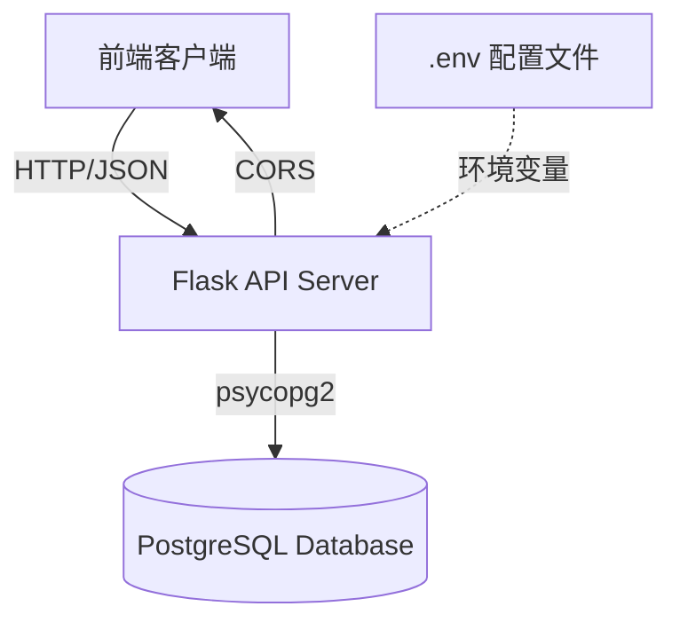
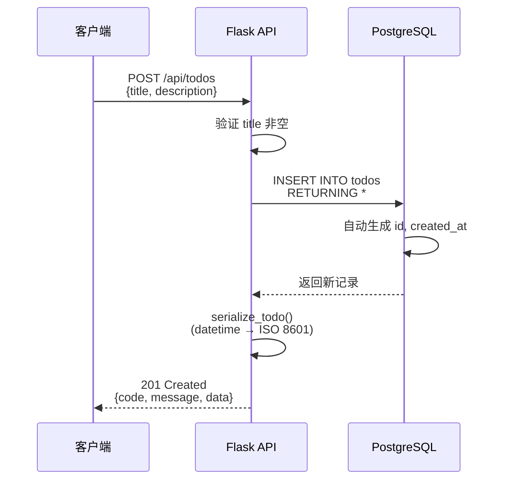
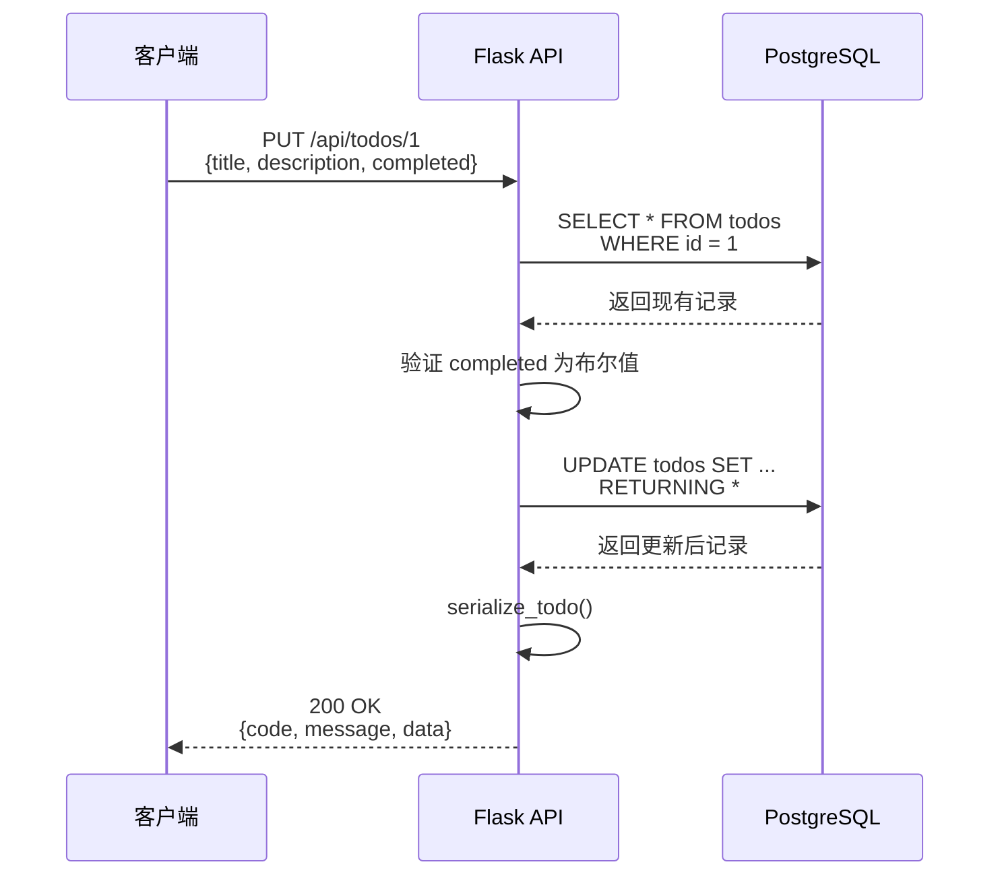

# Todo Backend 项目架构分析

## 项目概览

Todo Backend 是一个基于 Flask 和 PostgreSQL 的待办事项管理系统后端服务，采用 RESTful API 设计，实现了完整的 CRUD 操作。

> [!info] 技术栈
> - **Web 框架**: Flask 3.0.3
> - **数据库**: PostgreSQL 12+
> - **数据库驱动**: psycopg2-binary 2.9.9
> - **跨域支持**: flask-cors 4.0.1
> - **环境配置**: python-dotenv 1.0.1
> - **时区处理**: pytz 2024.1

## 架构设计

### 整体架构



### 项目结构

```
todo-backend/
├── app.py                    # 主应用程序入口
├── init_db.py               # 数据库初始化脚本
├── migrate_db.py            # 数据库迁移脚本（保留数据）
├── rebuild_db.py            # 数据库重建脚本（删除数据）
├── requirements.txt         # Python 依赖
├── .env                     # 环境变量配置
├── deploy.sh               # 部署脚本
├── docs/                   # 文档目录
│   ├── MIGRATION_SUMMARY.md
│   └── plans/              # 设计文档
└── test_*.py              # 测试脚本
```

## 核心模块分析

### 1. 应用入口 (app.py)

`app.py` 是整个应用的核心，包含以下关键组件：

#### 1.1 数据库连接管理

```python
def get_db_connection():
    """创建数据库连接"""
    conn = psycopg2.connect(
        host=os.getenv('DB_HOST', 'localhost'),
        database=os.getenv('DB_NAME', 'todo_app'),
        user=os.getenv('DB_USER', 'root'),
        password=os.getenv('DB_PASSWORD', '123456')
    )
    return conn
```

> [!warning] 连接池优化建议
> 当前实现为每次请求创建新连接，生产环境建议使用连接池（如 `psycopg2.pool`）以提升性能。

#### 1.2 统一响应格式

项目实现了统一的 API 响应格式：

```json
{
  "code": 200,
  "message": "ok",
  "data": { ... }
}
```

**实现函数：**
- `success_response()` - 成功响应
- `error_response()` - 错误响应
- `serialize_todo()` - 数据序列化（datetime → ISO 8601）

#### 1.3 RESTful API 端点

| 方法 | 路径 | 功能 | 状态码 |
|------|------|------|--------|
| GET | `/api/todos` | 获取所有待办事项 | 200 |
| POST | `/api/todos` | 创建新待办事项 | 201 |
| PUT | `/api/todos/<id>` | 更新待办事项 | 200 |
| DELETE | `/api/todos/<id>` | 删除待办事项 | 200 |
| GET | `/` | 健康检查 | 200 |

### 2. 数据库设计

#### 2.1 表结构 (todos)

```sql
CREATE TABLE todos (
    id BIGINT GENERATED ALWAYS AS IDENTITY PRIMARY KEY,
    title TEXT NOT NULL CHECK (LENGTH(title) <= 255 AND LENGTH(title) > 0),
    description TEXT,
    completed BOOLEAN NOT NULL DEFAULT FALSE,
    created_at TIMESTAMPTZ NOT NULL DEFAULT now()
);
```

**字段说明：**

| 字段 | 类型 | 约束 | 说明 |
|------|------|------|------|
| `id` | BIGINT | PRIMARY KEY, IDENTITY | 自增主键 |
| `title` | TEXT | NOT NULL, CHECK | 标题（1-255字符） |
| `description` | TEXT | - | 描述（可选） |
| `completed` | BOOLEAN | NOT NULL, DEFAULT FALSE | 完成状态 |
| `created_at` | TIMESTAMPTZ | NOT NULL, DEFAULT now() | 创建时间（带时区） |

#### 2.2 索引设计

```sql
-- 优化按完成状态查询
CREATE INDEX idx_todos_completed ON todos (completed);

-- 优化按时间排序（降序）
CREATE INDEX idx_todos_created_at ON todos (created_at DESC);
```

> [!tip] 性能优化
> - `idx_todos_completed` 加速状态筛选查询
> - `idx_todos_created_at` 支持高效的时间倒序排序
> - 降序索引直接匹配 `ORDER BY created_at DESC` 查询

#### 2.3 PostgreSQL 最佳实践

项目采用了以下 PostgreSQL 最佳实践：

- ✅ **BIGINT IDENTITY** 替代 SERIAL（更标准的自增主键）
- ✅ **TEXT** 替代 VARCHAR(n)（无长度限制，性能更好）
- ✅ **BOOLEAN** 替代 INTEGER（类型安全，节省空间）
- ✅ **TIMESTAMPTZ** 替代 TIMESTAMP（自动时区处理）
- ✅ **CHECK 约束** 确保数据完整性
- ✅ **索引优化** 针对常见查询模式

参考文档：[[2026-02-04-postgresql-best-practices-redesign]]

### 3. 数据库管理脚本

#### 3.1 init_db.py

首次安装时使用，创建表和索引。

```python
# 功能：
# - 创建 todos 表
# - 创建索引
# - 幂等操作（IF NOT EXISTS）
```

#### 3.2 migrate_db.py

生产环境数据迁移脚本，==保留现有数据==。

```python
# 功能：
# 1. 创建新表结构
# 2. 迁移数据（INTEGER → BOOLEAN，Unix时间戳 → TIMESTAMPTZ）
# 3. 创建索引
# 4. 备份旧表（todos_old）
```

#### 3.3 rebuild_db.py

开发环境使用，==删除所有数据==重建表。

> [!danger] 警告
> `rebuild_db.py` 会删除所有现有数据，仅用于开发环境！

## 数据流分析

### 创建待办事项流程



### 更新待办事项流程



## 关键特性

### 1. 时区处理

使用 `TIMESTAMPTZ` 类型自动处理时区：

```python
# 数据库存储：UTC 时间戳
# API 返回：ISO 8601 字符串（带时区）
# 示例：2026-02-04T10:00:00+08:00
```

**前端集成示例：**

```javascript
// 解析 ISO 8601 字符串
const createdDate = new Date(todo.created_at);

// 显示本地时间
const localTime = createdDate.toLocaleString();
```

### 2. 类型安全

#### completed 字段验证

```python
# 严格验证布尔类型
if not isinstance(completed, bool):
    return error_response(message='completed 字段必须是布尔值', code=400)
```

#### 数据库约束

```sql
-- 标题长度约束
CHECK (LENGTH(title) <= 255 AND LENGTH(title) > 0)

-- 非空约束
NOT NULL

-- 默认值
DEFAULT FALSE
```

### 3. CORS 支持

```python
from flask_cors import CORS
CORS(app)  # 允许所有来源的跨域请求
```

> [!warning] 生产环境建议
> 生产环境应限制 CORS 来源：
> ```python
> CORS(app, origins=["https://yourdomain.com"])
> ```

## 性能优化

### 存储优化

| 优化项 | 旧方案 | 新方案 | 收益 |
|--------|--------|--------|------|
| 完成状态 | INTEGER (4 bytes) | BOOLEAN (1 byte) | 节省 75% 空间 |
| 时间存储 | BIGINT (8 bytes) | TIMESTAMPTZ (8 bytes) | 自动时区转换 |
| 主键类型 | SERIAL | BIGINT IDENTITY | 更大范围，标准化 |

### 查询优化

1. **索引覆盖常见查询**
   ```sql
   -- 查询已完成的任务
   SELECT * FROM todos WHERE completed = true;  -- 使用 idx_todos_completed

   -- 按时间倒序查询
   SELECT * FROM todos ORDER BY created_at DESC;  -- 使用 idx_todos_created_at
   ```

2. **避免全表扫描**
   - 所有查询都有索引支持
   - 主键查询使用 B-tree 索引

## 部署架构

### 环境变量配置

```bash
# .env 文件
DB_HOST=localhost
DB_NAME=todo_app
DB_USER=your_username
DB_PASSWORD=your_password
PORT=5001
```

### 部署流程

```bash
# 1. 安装依赖
pip install -r requirements.txt

# 2. 配置环境变量
cp .env.example .env

# 3. 初始化数据库（首次）
python init_db.py

# 4. 启动服务
python app.py
```

### 生产环境建议

> [!important] 生产环境清单
> - [ ] 使用 Gunicorn/uWSGI 替代 Flask 开发服务器
> - [ ] 配置数据库连接池
> - [ ] 限制 CORS 来源
> - [ ] 添加日志记录
> - [ ] 实现请求限流
> - [ ] 配置 HTTPS
> - [ ] 使用环境变量管理敏感信息
> - [ ] 设置数据库备份策略

## 相关文档

- [[MIGRATION_SUMMARY]] - 数据库迁移总结
- [[2026-02-04-postgresql-best-practices-redesign]] - PostgreSQL 最佳实践设计
- [[2026-02-04-timestamp-storage-design]] - 时间戳存储优化设计

## 技术债务与改进建议

### 当前技术债务

1. **连接管理**
   - 每次请求创建新连接
   - 建议：实现连接池

2. **错误处理**
   - 通用异常捕获
   - 建议：细化异常类型，添加日志

3. **测试覆盖**
   - 缺少单元测试和集成测试
   - 建议：添加 pytest 测试套件

4. **API 文档**
   - 缺少 OpenAPI/Swagger 文档
   - 建议：集成 flask-swagger-ui

### 未来改进方向

- [ ] 添加用户认证（JWT）
- [ ] 实现分页查询
- [ ] 添加全文搜索
- [ ] 支持标签和分类
- [ ] 实现软删除
- [ ] 添加审计日志
- [ ] 支持批量操作

## 总结

Todo Backend 是一个结构清晰、遵循最佳实践的 Flask + PostgreSQL 项目。项目的核心优势在于：

1. **标准化设计** - 采用 RESTful API 和统一响应格式
2. **数据库优化** - 遵循 PostgreSQL 最佳实践，合理使用索引
3. **类型安全** - 使用原生数据类型（BOOLEAN、TIMESTAMPTZ）
4. **易于维护** - 代码结构清晰，文档完善

项目适合作为学习 Flask + PostgreSQL 的参考案例，也可作为实际项目的起点进行扩展。

---

*文档生成时间：2026-02-05*
*项目版本：基于 dev 分支*
